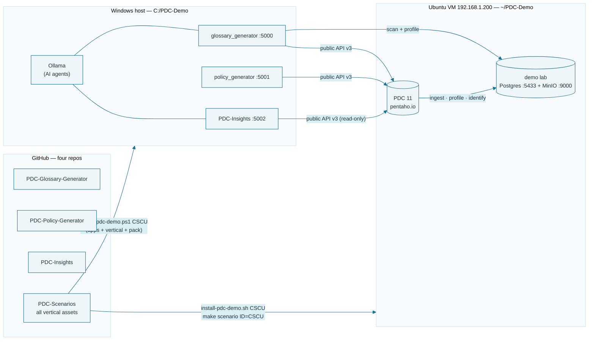

# PDC-Scenarios — the training verticals, one repo

Every per-scenario asset for the PDC training pipeline lives here, one
folder per vertical: the **data kit** (lab SQL, documents, bulk-load CSV),
the **domain pack** (governed vocabulary + steward roster), and the
**courseware** for the platform and both apps. The apps themselves stay in
their own repos — this repo is what gets deployed when you pick a vertical.

| Vertical | Industry | Data kit | Courseware |
| --- | --- | --- | --- |
| **CSCU** — Copper State Credit Union | Financial services | [data_sources/CSCU/](data_sources/CSCU/) | [courseware/CSCU/](courseware/CSCU/) |
| **RETAIL** — Canyon Trail Outfitters | Retail | [data_sources/RETAIL/](data_sources/RETAIL/) | [courseware/RETAIL/](courseware/RETAIL/) |
| **HEALTH** — Lakeshore Health Partners | Healthcare | [data_sources/HEALTH/](data_sources/HEALTH/) | [courseware/HEALTH/](courseware/HEALTH/) |
| **MFG** — Cascade Precision Components | Manufacturing | [data_sources/MFG/](data_sources/MFG/) | [courseware/MFG/](courseware/MFG/) |

The three apps the bootstrap deploys beside this repo:

- **[Glossary Generator](https://github.com/jporeilly/PDC-Glossary-Generator)** (:5000) —
  scans the scenario's sources, builds the governed glossary, writes the
  Classification Registry. `install-scenario.sh <ID>` installs the vertical's
  domain pack + roster into it.
- **[Policy Generator](https://github.com/jporeilly/PDC-Policy-Generator)** (:5001) —
  reads the Registry and authors PDC's Data Identification methods.
- **[Catalog Insights](https://github.com/jporeilly/PDC-Insights)** (:5002) —
  read-only dashboards + chat over the PDC catalog (search, facets,
  freshness), with an optional MCP server (:8765).

## The estate at a glance



## One command: the apps (Windows 11 host)

The standard topology runs the **apps on the Windows host** (Ollama lives
there) and the lab + PDC on the VM. The bootstrap stands up **`C:\PDC-Demo`**
— all three apps + the vertical, kept separate from any dev checkouts — and
installs the vertical's domain pack + roster into the Glossary app:

```powershell
iex "& { $(irm https://raw.githubusercontent.com/jporeilly/PDC-Scenarios/main/install-pdc-demo.ps1) } CSCU"
```

Re-run it bare to update everything (the vertical is remembered; pass an ID
to switch); then launch each app with `.\run.ps1` — `glossary_generator`
(:5000), `policy_generator` (:5001) and `PDC-Insights` (:5002). The full
end-to-end walk-through (host + VM + PDC connections) is in
[INSTALL.md](INSTALL.md).

## One command: the lab (Ubuntu VM)

On the VM, the bash twin stands up (or updates) the complete `~/PDC-Demo`
checkout — the Glossary Generator, the Policy Generator (sparse, app +
frontend), Catalog Insights, and this repo pulled sparse to the selected
vertical:

```bash
curl -fsSL https://raw.githubusercontent.com/jporeilly/PDC-Scenarios/main/install-pdc-demo.sh | bash -s -- CSCU
```

Then **one make entry** loads the vertical's data sources:

```bash
cd ~/PDC-Demo/PDC-Scenarios
make scenario ID=CSCU      # select + lab up + create/load its db + bucket
make pack ID=CSCU          # its domain pack + roster into the Glossary app
```

`make status` shows the lab and the selected vertical; `make down` stops the
lab (data survives); `make destroy` erases the scenario data. Each app repo
also carries its own `install-pdc-demo.sh` for single-app updates.

## Select a vertical (manual pieces)

```bash
./select-vertical.sh CSCU        # sparse-pull ONLY this vertical (+ shared lab)
cd data_sources/lab && make up && make load SCENARIO=CSCU
cd ../.. && ./install-scenario.sh CSCU     # pack + roster into the Glossary app
```

`select-vertical.sh` narrows the checkout to `data_sources/lab`,
`data_sources/<ID>` and `courseware/<ID>` — run it again to switch verticals,
`--all` for everything.

`install-scenario.sh` finds the Glossary app automatically (this repo cloned
beside/inside the app checkouts, e.g. the lab VM's `~/PDC-Demo`) or via
`GLOSSARY_APP_DIR=/path/to/glossary_generator`. `reset-scenario.sh` removes
the installed scenario again. One scenario at a time — rerunning the
installer switches and backs everything up.

## Layout

```text
data_sources/
  lab/                ONE PostgreSQL + ONE MinIO for all verticals;
                      make load SCENARIO=<ID> creates that vertical's db + bucket
  <ID>/               the vertical's kit: scenario.json manifest, postgres-init
                      SQL, documents, domain pack + install zip, bulk-load CSV
courseware/
  <ID>/Platform/      PDC platform courseware: Workshops 00-05 (+ the
                      Technical Track on CSCU)
  <ID>/Glossary/      the Glossary Generator app workshop + topic notes
  <ID>/Policy/        the Policy Generator app workshop
                      (each set's tools/build-docx.py regenerates its .docx)
  PDC-Users-All-Scenarios.{csv,md}   consolidated user roster, all verticals
diagrams/             app diagrams the courseware builders embed
install-pdc-demo.sh   ONE bootstrap (VM): all three apps + this repo (sparse) into ~/PDC-Demo
install-pdc-demo.ps1  the same for the Windows host (+ installs the pack into the app)
Makefile              make scenario ID=<ID> — select + lab up + load; pack/status/down
install-scenario.sh   install a vertical's pack + roster into the Glossary app
reset-scenario.sh     remove it again (reset the app to generic)
select-vertical.sh    sparse-pull just one vertical from this repo
```

New verticals plug in the same way: a `data_sources/<ID>/` with a
`scenario.json` beside a `courseware/<ID>/` set — no code changes anywhere.

*All scenario data — Copper State Credit Union, Canyon Trail Outfitters,
Lakeshore Health Partners and Cascade Precision Components — is fictional and
generated for training.*
